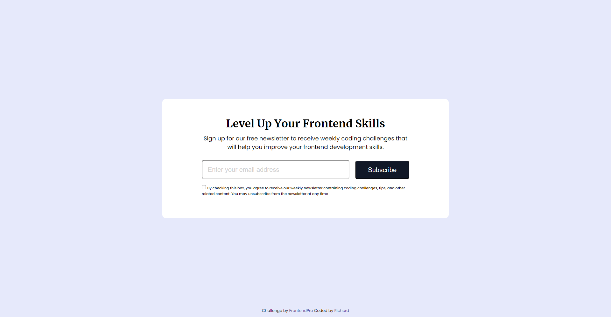

# Frontend Mentor - Newsletter Card Component

This is a solution to the [Newsletter Card Component challenge on FrontendPro](https://www.frontendpro.dev/frontend-coding-challenges/newsletter-card-component-Q3mJZ3AVwbEW4BEKYCKF).

## Table of contents

- [Overview](#overview)
  - [The challenge](#the-challenge)
  - [Challenge Requirements](#challenge-requirements)
  - [Screenshot](#screenshot)
  - [Links](#links)
- [My process](#my-process)
  - [Built with](#built-with)
- [Style Guide](#style-guide)
  - [Colors](#colors)
  - [Typography](#typography)
  - [Font](#font)
- [Author](#author)

## Overview

### The challenge

Users should be able to:
- Subscribe to a newsletter using an email.
- Receive weekly coding challenges.

### Challenge Requiremnents

- The Newsletter Card Component should have an email input field for the user to enter their email address and a subscribe button.
- An email input field should be validated before the user can submit the form.
- If the email address is not valid, an error alert message should be displayed to the user.
- When the user clicks on the subscribe button, a success message should be displayed to the user.
- Show the hover state of all the elements.
- The component should be responsive and display correctly on different screen sizes.
- Make this landing page look as close to the design as possible.

### Screenshot

### Links

- Solution URL: [Go to page](https://github.com/richcrd/newsletter_card.git)
- Live Site URL: [Go to page](https://richcrd.github.io/newsletter_card/)

## My process

### Built with

- Semantic HTML5 markup
- CSS custom properties
- Flexbox
- JavaScript Validation, functions && alerts

## Style Guide

### Colors

- #E6E9FB
- #000
- #fff
- rgb(209, 209, 209)
- #111827
- #5a5a5a
- hsl(228, 45%, 44%)

### Typography

- Font size: 16px

### Font

- Family: [Poppins](https://fonts.googleapis.com/css2?family=Poppins:ital,wght@0,100;0,200;0,300;0,400;0,500;0,600;0,700;0,800;0,900;1,100;1,200;1,300;1,400;1,500;1,600;1,700;1,800;1,900&display=swap)
- Weights: 100...
- Family: [Merriweather](https://fonts.googleapis.com/css2?family=Merriweather:ital,wght@0,300;0,400;0,700;0,900;1,300;1,400;1,700;1,900&display=swap)
- Weights: 100...

## Author

- FrontendPro - [@richcrd](https://www.frontendpro.dev/richcrd/my-solutions)
