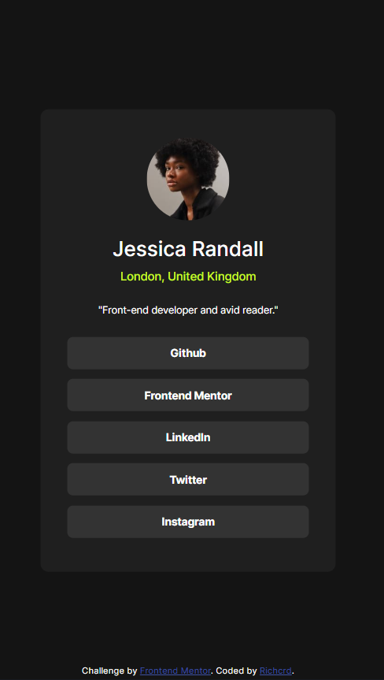

# Frontend Mentor - Social links profile solution

This is a solution to the [Social links profile challenge on Frontend Mentor](https://www.frontendmentor.io/challenges/social-links-profile-UG32l9m6dQ). Frontend Mentor challenges help you improve your coding skills by building realistic projects. 

## Table of contents

- [Overview](#overview)
  - [The challenge](#the-challenge)
  - [Screenshot](#screenshot)
  - [Links](#links)
- [My process](#my-process)
  - [Built with](#built-with)
  - [What I learned](#what-i-learned)
- [Author](#author)

**Note: Delete this note and update the table of contents based on what sections you keep.**

## Overview

### The challenge

Users should be able to:

- See hover and focus states for all interactive elements on the page

### Screenshot

### Links

- Solution URL: [Solution URL](https://github.com/richcrd/Social-links-profile.git)
- Live Site URL: [Live site URL](https://richcrd.github.io/Social-links-profile/)

## My process

### Built with

- Semantic HTML5 markup
- CSS custom properties
- Flexbox

### What I learned

### What I learned

Throughout this project, I gained insights into several key aspects of front-end development. Here are some of the major learnings I'd like to highlight:

1. **HTML Structure**: I deepened my understanding of structuring web pages using HTML. By organizing elements such as the main container, image container, titles, and links container, I learned how to create a well-organized layout.

2. **CSS Styling**: Through styling with CSS, I enhanced my skills in customizing the visual appearance of elements. Utilizing techniques such as flexbox for layout and CSS variables for consistent color management, I achieved the desired design aesthetic.

By reflecting on these learnings and providing code samples from the project, I solidified my understanding of front-end development concepts and techniques. This project served as a valuable opportunity for me to reinforce my knowledge and skills in building user-friendly web interfaces.

## Author

- Frontend Mentor - [@richcrd](https://www.frontendmentor.io/profile/richcrd)